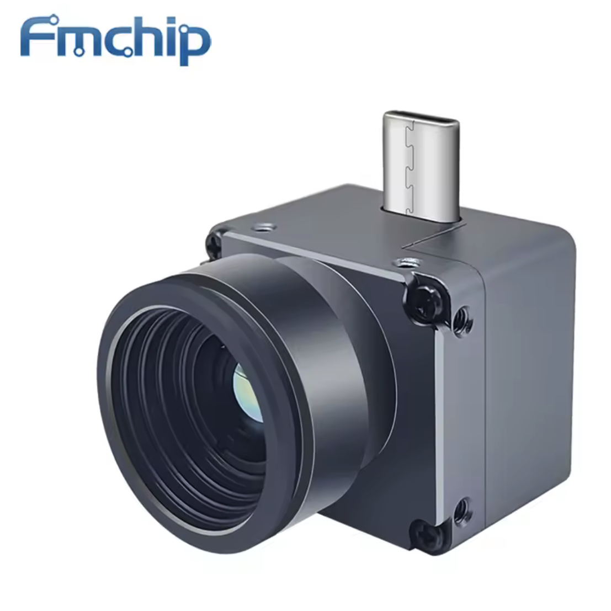
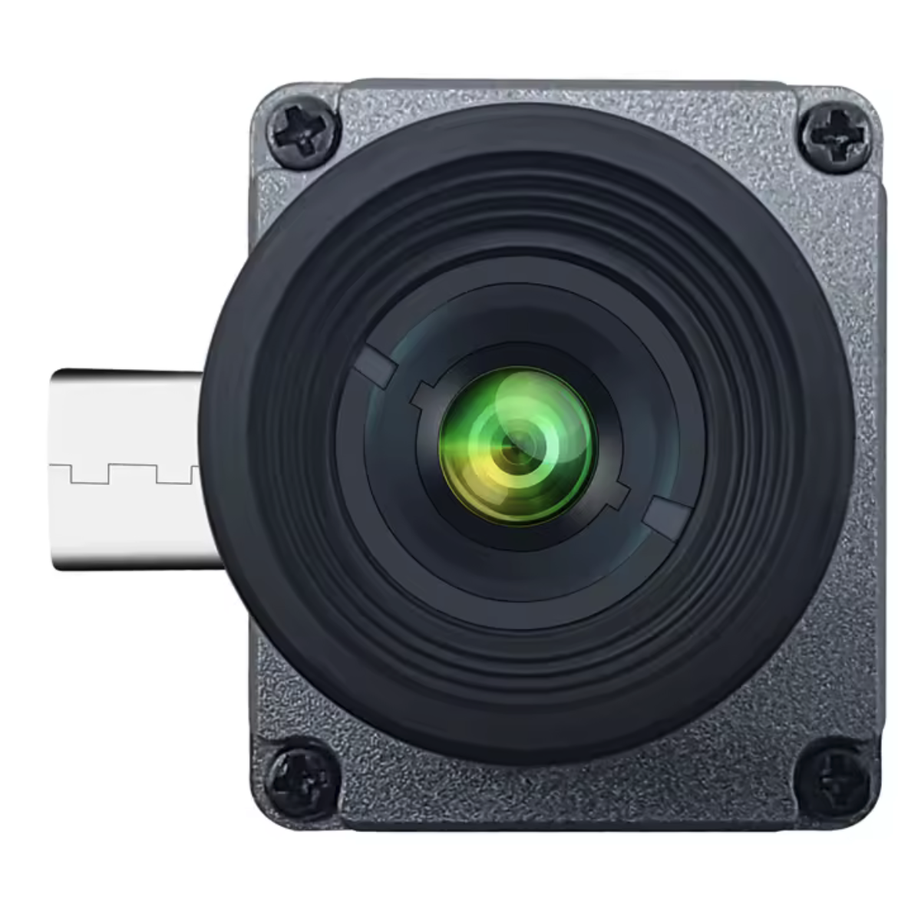

# NightCat-X2
NightCat X2 Thermal Imaging Camera Webcam Server

  
  

Python server which will open webcam stream on port 8081.

Tested on Raspberry Pi CM4 with Waveshare CM4-IO-BASE-A.

Can be connected to Klipper as U4VL-MJPEG webcam on address http://rpi.local:8081

